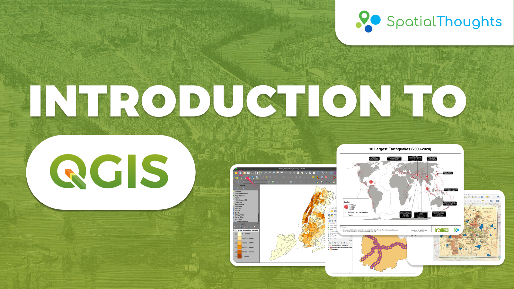

# GIS Coursework - Introduction to QGIS

**Course:** Introduction to QGIS  
**Instructor:** Ujaval Gandhi  
**Semester/Year:** February 2025  

# 

# **Introduction to QGIS**

This is an **introductory course** that covers **QGIS from the very basics**. You will learn how to use QGIS for **mapping, spatial data processing, and spatial analysis**. This class is ideal for participants with a basic knowledge of GIS who want to learn how to use QGIS to carry out common GIS tasks.

---

## **Duration**
🕒 **12 Hours** (Typically conducted in **4 sessions** of **3 hours each** over **2 weeks**)

## **Prerequisites**
✅ Familiarity with **GIS concepts**

## **Learning Outcomes**
✔️ Load, view, and query spatial datasets in QGIS  
✔️ Create and edit spatial data using QGIS  
✔️ Use QGIS for common spatial analysis tasks  
✔️ Create **data visualizations and maps**  

---

## **Course Outline**

### **📌 Creating Maps**
- Importing **Shapefiles** and **CSV files**
- Filtering and selecting data records using **QGIS Expressions**
- Creating **Proportional Circle Symbology**
- Labelling features
- Creating **Maps using Print Layouts**

### **📌 Visualizing Spatial Data**
- Table Joins
- Creating **Choropleth Maps**
- Georeferencing
- Using **Basemaps**
- Utilizing the **Georeferencer Tool**

### **📌 Data Editing**
- Attribute Forms
- Digitizing **Polygons**

### **📌 Geoprocessing**
- Downloading **OpenStreetMap Data**
- **Reprojecting** and **Buffering** data
- **Zonal Statistics** analysis

---

This course is designed to give you a **strong foundation in QGIS**, enabling you to confidently **perform spatial analysis and cartographic visualization**.

**Acknowledgements:**
*   [Spatial Thoughts](https://spatialthoughts.com/)
*   [Natural Earth Data](https://www.naturalearthdata.com/downloads/)
*   [NOAA](https://www.noaa.gov/)
